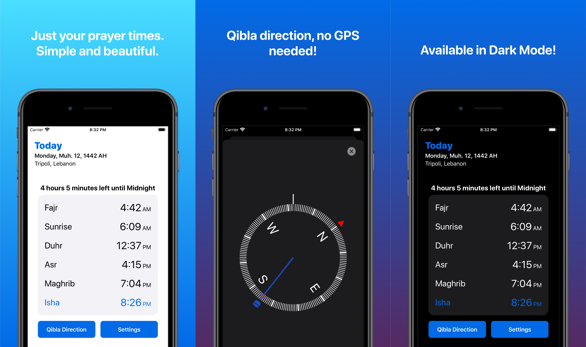

# Salli
> iOS Application for Prayer Times and Qibla Direction.

[![Swift Version][swift-image]][swift-url]

One to two paragraph statement about your product and what it does.

## Features

- [x] View Islamic Prayer Times (+ option to add times of Midnight and Imsak) and time remaining until the next prayer.
- [x] View Qibla Direction using automatic location or by entering city and country manually.
- [x] Choose Prayer Time Calculation Method
- [x] Support for Dark Mode and Localizations in English, Arabic and French.

## Requirements

- iOS 13.0+
- Xcode 11.6
